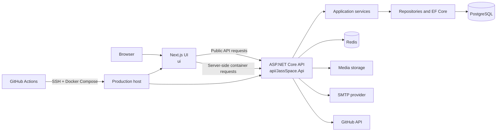
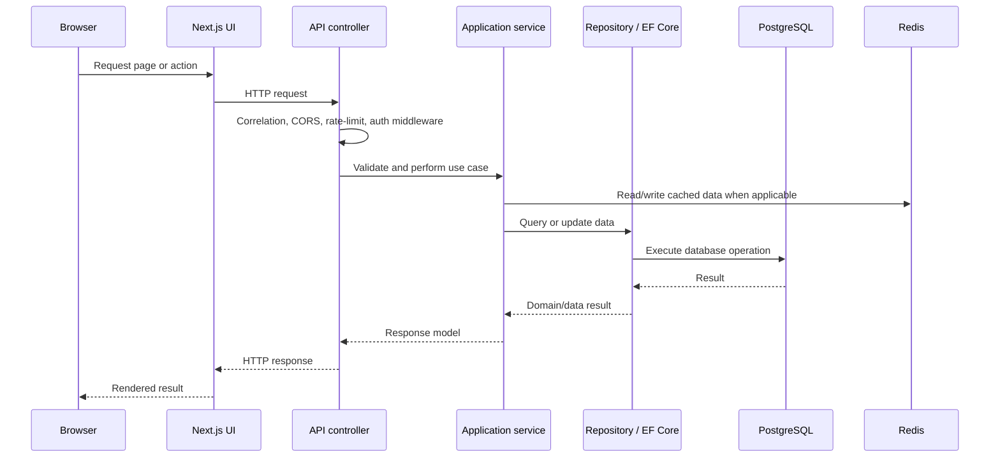
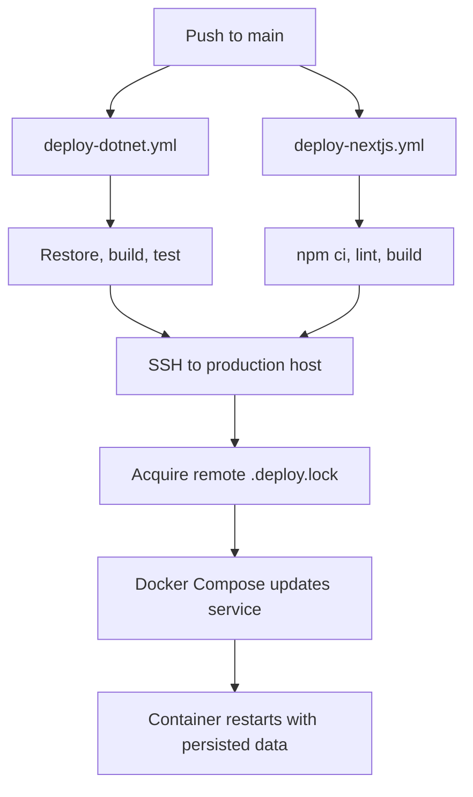

# Architecture

JassisWebspace is a containerized web application with a Next.js user interface,
an ASP.NET Core API, PostgreSQL for durable data, and Redis for shared caching and
rate-limiting support. The application runs as separate UI and API services so each
can be built and deployed independently.

## System Overview

## Application Boundaries

| Area | Responsibility | Main location |
| --- | --- | --- |
| UI | Public pages, account/admin screens, client interaction, server-side API calls | `ui/` |
| API host | HTTP endpoints, authentication, middleware, OpenAPI, background-job setup | `api/JassSpace.Api/` |
| Services | Business rules, integrations, validation, caching behavior | `api/JassSpace.Services/` |
| Data | EF Core context, repositories, migrations, persistence models | `api/JassSpace.Data/` |
| Shared contracts | Request/response models and cross-layer contracts | `api/JassSpace.Contracts/` |
| Domain entities | Core application entities | `api/JassSpace.Entities/` |
| Infrastructure | PostgreSQL, Redis, media storage, SMTP, GitHub and OAuth providers | Docker/environment configuration |

The UI uses `NEXT_PUBLIC_API_URL` for browser-facing requests. In Docker, the UI
can call the API over the internal service address `http://dotnet:8080` through
`API_URL`, avoiding a public network round-trip for server-side work.

## API Request Path

`Program.cs` owns composition of the host: Serilog logging, EF Core and
PostgreSQL, JWT authentication, custom CORS and rate limiting, Redis, Hangfire,
forwarded headers, correlation IDs, request logging, and endpoint middleware.

## Authentication And Authorization

The API supports JWT-based authentication along with Google and GitHub OAuth.
Authorization is enforced at controller/endpoint boundaries and is used by account
and administrative routes. The UI holds the presentation and navigation concerns;
the API remains the authority for user identity and protected operations.

Relevant configuration groups include `Jwt`, `OAuth`, and the configured CORS
origins. Values belong in environment variables or secret storage, never in source
control.

## Content And Media

Public content is served through API areas such as blog, gallery, music, comments,
likes, views, SEO, UI properties, and media. Administrative endpoints govern
content management and other protected operations.

Media operations use the configured media provider and local cache directory. The
API may use Azure Blob Storage or Cloudinary configuration. Docker persists cached
media in the `dotnet-media-cache` named volume for local and production container
setups, allowing the volume to retain the non-root ownership set by the API image.

## Background Work And Operations

Hangfire is registered in the API and persists its state in PostgreSQL. The
application exposes its dashboard at `/hangfire` under the configured authorization
policy and schedules account-cleanup work. Startup can apply database migrations
when `ApplyMigrationsOnStartup` is enabled; production controls this through the
`APPLY_MIGRATIONS` environment value.

Operational safeguards include:

- Forwarded-header handling for reverse-proxy deployments.
- Correlation IDs and Serilog request logging for traceability.
- Startup checks for PostgreSQL and Redis availability.
- Named rate-limiting policies for public API traffic.

## Deployment Flow

The API and UI deployment workflows are scoped by changed paths, so a UI-only
change does not need to rebuild the API and vice versa. Both workflows use the same
GitHub Actions concurrency group and a remote deployment lock to prevent competing
production updates. `refresh-containers.yml` provides a manual container-refresh
option.

## Local Runtime

Docker Compose exposes the UI at port `3001` and the API at port `5001` locally.
The API listens on container port `8080`, mapped to host port `5001`. PostgreSQL,
Redis, and local storage services are configured through the root `.env` file;
start from `.env.example` and keep actual values untracked.

For setup and run commands, see the [root README](../README.md). For API-specific
routes, configuration, and migration guidance, see the [API README](../api/README.md).
