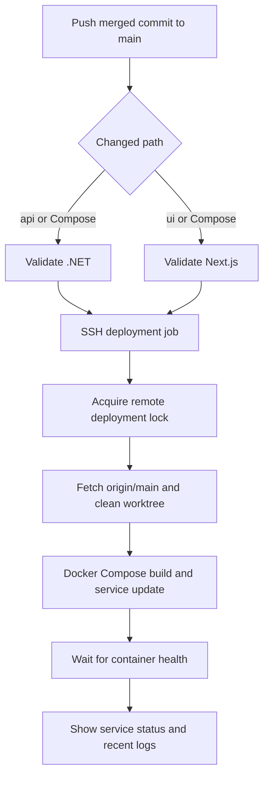

# Deployment Guide

Production deployment is driven by GitHub Actions when changes are pushed to `main`. The API and UI validate and deploy independently, so a UI-only change does not need to rebuild the API and vice versa.

## Deployment Workflows

| Workflow | Trigger | Validation | Service updated |
| --- | --- | --- | --- |
| `deploy-dotnet.yml` | Push to `main` affecting `api/`, Compose files, or the workflow | Restore, release build, test | `dotnet` |
| `deploy-nextjs.yml` | Push to `main` affecting `ui/`, Compose files, or the workflow | `npm ci`, lint, build | `nextjs` |
| `refresh-containers.yml` | Manual dispatch | None | All Compose services are recreated |

Each workflow also supports `workflow_dispatch` from GitHub Actions.

## Before You Deploy

1. Merge the intended change into `main`.
2. Confirm the GitHub production secrets exist.
3. Ensure the remote host has Docker Compose, Git, `flock`, and the configured deployment directory.
4. Keep production configuration in the remote `.env` file or approved secret storage. Do not commit production values.

The deployment workflows require these GitHub secrets:

| Secret | Purpose |
| --- | --- |
| `SSH_HOST` | Production server host name or address |
| `SSH_PORT` | SSH port; defaults to `22` when omitted by the workflow |
| `SSH_USER` | SSH user allowed to deploy |
| `SSH_PRIVATE_KEY` | Private key loaded into the workflow SSH agent |
| `REMOTE_DIR` | Absolute repository directory on the production host |

The workflow checks its required values before connecting. Secret values never belong in workflow files, documentation, or commits.

## What Happens On A Main Push



The .NET workflow uses the SDK in `api/global.json` and runs:

```powershell
dotnet restore JassSpace.sln
dotnet build JassSpace.sln --no-restore --configuration Release
dotnet test JassSpace.sln --no-build --configuration Release
```

The Next.js workflow uses Node.js 20 and runs:

```powershell
npm ci
npm run lint
npm run build
```

Only a successful validation job can start its deployment job.

## Remote Server Procedure

After SSH authentication, the workflow takes an exclusive lock at `<REMOTE_DIR>/.deploy.lock`, waiting for up to 10 minutes. The automatic deployment workflows share the `jassspace-production-deploy` concurrency group; the lock also protects the server when jobs reach it at different times.

With the lock held, the deployment job:

1. Fetches remote branches and prunes removed references.
2. Forces the remote checkout to `origin/main`.
3. Removes untracked files except the `logs/` directory.
4. Rebuilds the affected Docker Compose service with BuildKit.
5. Starts the service with `--wait --wait-timeout 180`.
6. Shows Compose service status and the latest five minutes of service logs.

The remote checkout is a deployment artifact, not a working directory. Do not make manual source edits there: the next deployment resets the repository to `origin/main` and removes untracked files other than `logs/`.

## Manual Container Refresh

Use `refresh-containers.yml` only when a full recreation is needed, such as after a host-level configuration change or to recover from an unhealthy container set. It runs:

```powershell
docker compose -p jassspace up -d --force-recreate --remove-orphans --wait --wait-timeout 180
```

It also takes the same remote `.deploy.lock`. Avoid starting it while an automatic deployment is expected; the lock prevents simultaneous Compose changes, but the manual workflow has its own GitHub Actions concurrency group.

## Monitoring A Deployment

In GitHub Actions, inspect the validation job first. If validation passed, the deployment job records connection setup, lock acquisition, Compose completion, and recent service logs. On the server, use:

```powershell
docker compose -p jassspace ps
docker compose -p jassspace logs dotnet --since=5m
docker compose -p jassspace logs nextjs --since=5m
```

Application logs are persisted through the Compose volume configuration. Check those logs alongside GitHub Actions output when a deployment completes but the application is not healthy.

## Rollback

Deployments always use the current `main` commit. To roll back safely:

1. Identify the last known-good commit on `main`.
2. Revert the faulty change in Git, creating a new commit on `main`.
3. Push the revert and allow the normal path-specific deployment workflow to run.
4. Verify the affected service and its recent logs.

Avoid changing the remote checkout to an older commit by hand. A source-controlled revert is auditable and remains stable on the next deployment.

For the system-level picture, see [Architecture](architecture.md). For local configuration and startup, see the [root README](../README.md).
