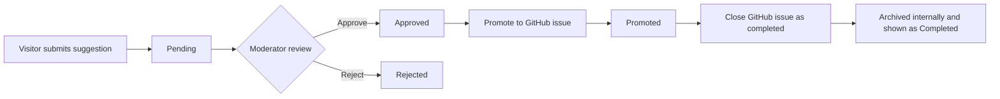
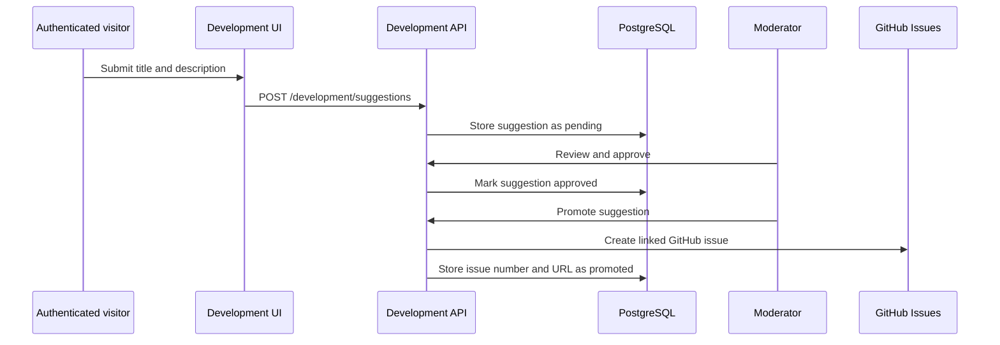

# Development Wall

The development wall at `/development` is the public view of product work. It combines GitHub issues and releases with suggestions and notes stored by JassisWebspace, while keeping visitor-facing progress clear and positive.

## What Visitors Can See

The public wall provides:

| Area | Source | Purpose |
| --- | --- | --- |
| Issues | GitHub Issues API | Shows current and completed work with filters and search |
| Releases | GitHub Releases API | Shows published release activity |
| Notes | JassisWebspace database | Shows published update notes |
| Suggestions | JassisWebspace database | Shows approved or promoted visitor suggestions |
| Summary | GitHub plus database | Shows counts and recent activity in navigation and overview views |

Public endpoints are anonymous. Submitting a suggestion requires an authenticated user and is rate-limited by the `development-suggestion` policy.

## Suggestion Lifecycle



| Internal status | Meaning | Public visibility |
| --- | --- | --- |
| `pending` | New submission awaiting review | Not shown in public suggestions |
| `approved` | Accepted for consideration | Shown publicly |
| `promoted` | Linked to a GitHub issue | Shown publicly with its GitHub issue link |
| `rejected` | Not proceeding | Admin-only; progress UI treats it as resolved |
| `archived` | Promoted issue was closed | Admin-only; progress UI treats it as completed |

The public suggestion query deliberately includes only `approved` and `promoted` records. Completed work is represented through GitHub's closed issue list rather than leaving an archived suggestion in the public suggestions list.

## Issue Completion Behavior

The admin action to close a promoted issue calls GitHub with:

```json
{
  "state": "closed",
  "state_reason": "completed"
}
```

After GitHub accepts the change, the linked local suggestion is marked `archived`. In the UI, a closed issue and an archived or rejected suggestion are presented at the green **Completed** stage. The development wall never labels this normal closure path as "not planned."

## Visitor Submission Flow



Suggestions are validated before storage. When promotion succeeds, the API records the GitHub issue number and URL, associates the review action with the moderator, and sends the promotion notification email.

## GitHub Integration

The service reads issues and releases from the repository configured by:

| Setting | Role |
| --- | --- |
| `GitHub__Owner` | Repository owner or organization |
| `GitHub__Repository` | Repository that holds issues and releases |
| `GitHub__Token` | Server-only token required to create or close issues |
| `GitHub__CacheMinutes` | Read-cache duration; values from 1 to 60 minutes are used when caching is enabled |

Issues support `state`, `label`, `milestone`, `search`, `page`, and `pageSize` query parameters. GitHub pull requests are excluded from the issue feed. GitHub reads are cached in Redis when `GitHub__CacheMinutes` is greater than zero; cached views can therefore lag GitHub by the configured duration.

If GitHub is unavailable, issue promotion and closure return a gateway error without changing the local suggestion state. Fix the integration or retry after GitHub becomes available.

## Admin Workflow

The admin interface lives at `/admin/development` and requires the `admin` or `mod` role. Use it to:

1. Review pending suggestions and update their title, body, or status.
2. Approve a worthwhile suggestion before promotion.
3. Promote only an approved suggestion, optionally refining its title and description first.
4. Track the linked GitHub issue through the stored URL and number.
5. Close completed promoted issues using the dedicated close action.
6. Create, edit, publish, or remove development notes.

A suggestion cannot be promoted twice, and it cannot be marked `promoted` until a GitHub issue exists. The dedicated close action requires an existing GitHub issue link.

## API Surface

| Route | Access | Purpose |
| --- | --- | --- |
| `GET /development/summary` | Public | Counts and recent issues, releases, notes, and suggestions |
| `GET /development/issues` | Public | Paginated/filterable GitHub issue list |
| `GET /development/releases` | Public | GitHub releases with published notes |
| `GET /development/suggestions` | Public | Approved and promoted suggestions |
| `POST /development/suggestions` | Authenticated | Create a pending suggestion |
| `GET /admin/development/suggestions` | Admin or moderator | Review all suggestions with status filter and pagination |
| `PUT /admin/development/suggestions/{id}` | Admin or moderator | Edit a suggestion and its status |
| `POST /admin/development/suggestions/{id}/promote` | Admin or moderator | Create and link a GitHub issue |
| `POST /admin/development/suggestions/{id}/close-issue` | Admin or moderator | Close the linked GitHub issue as completed |
| `/admin/development/notes` | Admin or moderator | Create, update, list, and delete notes |

For required GitHub variables, see [Environment Configuration](environment.md). For the wider integration and cache boundaries, see [Architecture](architecture.md).
